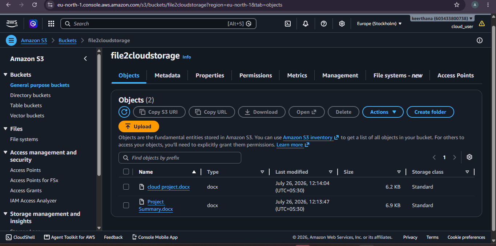
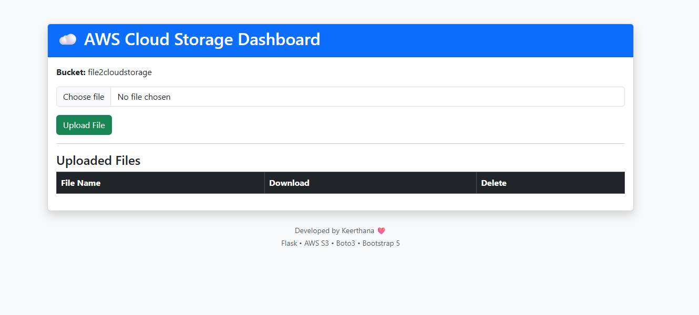
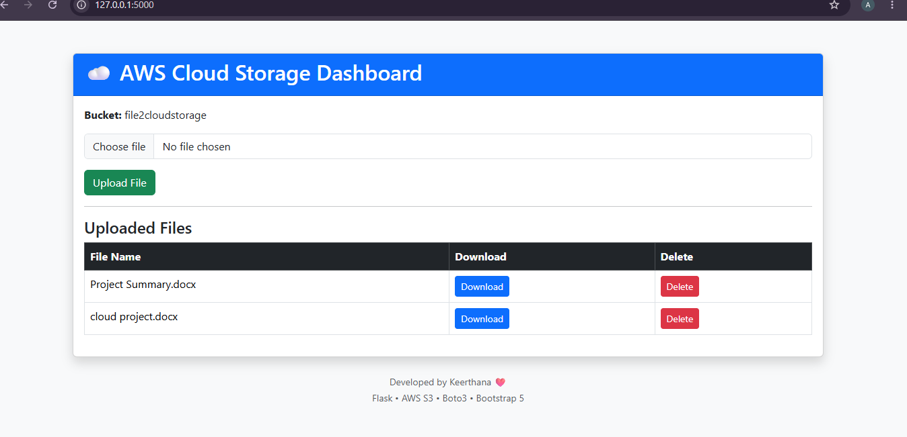

# Cloud-Based File Storage System

## Project Overview
This project is a Cloud-Based File Storage System built using Python Flask and AWS S3. It allows users to upload and manage files securely in the cloud.

## Features
- Upload files to AWS S3
- Secure cloud storage
- File management
- Responsive user interface

## Technologies Used
- Python
- Flask
- AWS S3
- Boto3
- HTML
- CSS
- Bootstrap 5

## AWS Services Used
- Amazon S3
- IAM

## Project Structure

cloud-storage/
├── app.py
├── templates/
├── static/
├── requirements.txt
└── README.md

## How to Run

1. Install dependencies:

```bash
pip install -r requirements.txt
```

2. Run the application:

```bash
python app.py
```

3. Open your browser:

```
http://localhost:5000
```

## Future Enhancements
- User authentication
- File sharing
- File download
- Notifications
  
##screenshots






